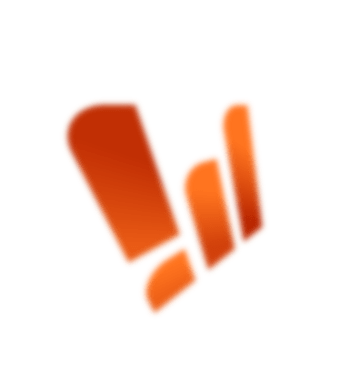

<p align="center">
  
</p>

<h1 align="center">Top Mining</h1>

<p align="center">
  <strong>Платформа о майнинге:</strong> каталог компаний, рейтинги, статьи<br/>
  и лендинги подбора ASIC, майнинг-отелей и консалтинга
</p>

<p align="center">
  <a href="https://top-mining.ru">
    
  </a>
</p>

<p align="center">
  <a href="https://top-mining.ru"><strong>top-mining.ru</strong></a>
  &nbsp;·&nbsp; Nuxt 3 · Vue 3 · TypeScript
</p>

<p align="center">
  
  
  
  
  
  
</p>

---

## Быстрый старт

```bash
npm install
npm run dev          # http://localhost:3000
npm run storybook    # UI-kit / визуальные сторис
npm run test:run     # unit-тесты
```

| Команда | Что делает |
|---------|------------|
| `npm run dev` | Dev-сервер Nuxt |
| `npm run build` | Production-сборка |
| `npm run preview` | Предпросмотр сборки |
| `npm run lint` | ESLint + Stylelint |
| `npm run storybook` | Storybook на порту `6007` |
| `npm run test` | Vitest в watch-режиме |

---

## Стек

| Слой | Технологии |
|------|------------|
| Frontend | **Nuxt 3**, Vue 3, TypeScript |
| UI | Quasar (`nuxt-quasar-ui`), `@nuxt/ui`, Tailwind CSS 4 |
| Стили | SCSS-токены, BEM в компонентах, шрифт **Unbounded** |
| Качество | ESLint, Stylelint, Prettier, Vitest, Storybook |
| Backend | Go + GraphQL + PostgreSQL → [`backend/README.md`](./backend/README.md) |

---

## Возможности продукта

<p align="center">
  
</p>

- **Каталог** организаций: майнинг-отели, пулы, продажи ASIC, фильтры и карточки
- **Рейтинги** и статьи по майнингу
- **Лендинги**: покупка ASIC, подбор майнинг-отеля, консалтинг, увеличение дохода
- **Дизайн-система**: глобальные кнопки, инпуты, чипы, токены в Storybook

---

## Структура

```text
top-mining/
├── assets/                 # Стили, шрифты, изображения
├── common/modules/         # Данные, типы и логика по доменам
├── components/
│   ├── global/             # Переиспользуемый UI
│   ├── top-mining/         # Шапка, футер, секции главной
│   ├── catalog/            # Каталог и карточки организаций
│   ├── buy-asic/           # hero · models · shared · banners
│   ├── podbor/             # Подбор майнинг-отеля
│   ├── consulting/         # Консалтинг
│   └── ...
├── pages/                  # Маршруты (тонкая композиция)
├── server/api/             # Nitro API / прокси к GraphQL
├── stories/                # Storybook
├── docs/                   # Документация и бренд-ассеты
└── backend/                # Go GraphQL + Postgres
```

Подробная карта клиента: [`docs/frontend.md`](./docs/frontend.md)  
Зоны компонентов: [`components/README.md`](./components/README.md)

---

## Принципы кода

1. **Страница** (`pages/`) — маршрут, SEO, сборка секций.
2. **Компонент** (`components/<домен>/`) — UI и локальное состояние.
3. **Модуль** (`common/modules/<домен>/`) — типы, константы, тексты, чистая логика.
4. **API** (`server/api/`) — HTTP для браузера, часто GraphQL к Go.

```ts
import { TOP_MINING_BUTTON_PROPS } from '~/common/modules/top-mining'
import type { CatalogOrganization } from '~/common/modules/catalog'
```

Токены и цвета — в `assets/scss/variables.scss`:

```css
color: var(--tm-orange);
background: var(--tm-ink);
```

---

## Куда класть новый код

| Задача | Куда |
|--------|------|
| Новая страница | `pages/<route>.vue` |
| UI фичи | `components/<домен>/` |
| Шапка / меню | `components/top-mining/header/` + данные в `common/modules/` |
| Типы и константы | `common/modules/<домен>/` |
| API-эндпоинт | `server/api/` |
| Глобальный стиль | `assets/scss/` |

---

## Документация

| Документ | Описание |
|----------|----------|
| [`docs/frontend.md`](./docs/frontend.md) | Архитектура фронтенда |
| [`backend/README.md`](./backend/README.md) | GraphQL, Postgres, миграции |
| [`components/README.md`](./components/README.md) | Зоны Vue-компонентов |
| [`docs/brand/`](./docs/brand/) | Логотип и иконки бренда |

---

<p align="center">
  
  <br/>
  <sub>© Top Mining · консалтинг и рейтинги в майнинге</sub>
</p>
