<p align="center">
  
</p>

<h1 align="center">Top Mining</h1>

<p align="center">
  <strong>Платформа о майнинге</strong><br/>
  каталог · рейтинги · статьи · калькулятор · конвертер · лендинги
</p>

<p align="center">
  <a href="https://top-mining.ru"><strong>top-mining.ru</strong></a>
  ·
  <a href="./docs/business.md">Бизнес</a>
  ·
  <a href="./docs/architecture.md">Архитектура</a>
  ·
  <a href="./docs/testing.md">Тесты</a>
  ·
  <a href="./backend/README.md">Backend</a>
</p>

<p align="center">
  
  
  
  
  
  
  
</p>

---

## Быстрый старт

```bash
npm install
npm run dev              # http://localhost:3000
npm run storybook        # http://localhost:6007
npm run test:run         # Vitest
npm run test:e2e         # Playwright (app + Storybook)
```

| Команда | Назначение |
|---------|------------|
| `npm run dev` | Nuxt |
| `npm run lint` | ESLint + Stylelint |
| `npm run test` / `test:run` | Unit |
| `npm run test:e2e` | E2E |
| `npm run storybook` | UI-kit |

Backend (Go + Postgres): [`backend/README.md`](./backend/README.md).

---

## Стек

```text
Browser (Nuxt 3 · Vue 3 · TS · Quasar · Tailwind)
        │  /api/*
Nitro BFF  →  Go GraphQL (:8080)  →  PostgreSQL
```

Расчёт калькулятора — **на клиенте**; API отдаёт справочники железа и рынка.

---

## Возможности

- Каталог организаций (отели, пулы, ASIC, фильтры)
- Рейтинги и статьи (RU / EN-блоки)
- Калькулятор доходности ASIC / GPU / CPU
- Конвертер хешрейта
- Лендинги: buy-ASIC, подбор отеля, консалтинг, ЦОД, increase-income
- Заявки → Postgres + Telegram

---

## Бизнес-задачи и процессы

Цепочка ценности: **узнать → сравнить → посчитать → заявка**.

Подробно (BZ/BP, шаблоны схем, чеклист): [`docs/business.md`](./docs/business.md)  
PNG: [`docs/diagrams/business/`](./docs/diagrams/business/)

| ID | Задача | Процесс |
|----|--------|---------|
| BZ-01 | Информировать о рынке | BP-01 Главная |
| BZ-02 | Найти организацию | BP-02 Каталог |
| BZ-04 | Оценить доходность | BP-04 Калькулятор |
| BZ-05 | Перевести хешрейт | BP-05 Конвертер |
| BZ-06 / 07 | Рейтинги и статьи | BP-06 / BP-07 |
| BZ-08 / 09 | Подбор и лендинги услуг | BP-08 / BP-09 |
| BZ-10 | Собрать лид | BP-10 Лиды |
| BZ-11 / 12 | Подписка и отзывы | BP-11 / BP-12 |

### Путь клиента

<p align="center">
  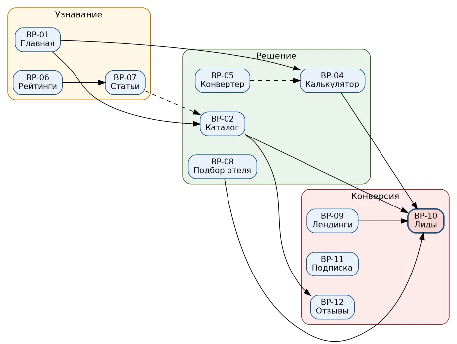
</p>

### Ключевые схемы

<details>
<summary><strong>BPMN — калькулятор (BP-04)</strong></summary>
<br/>
<p align="center">
  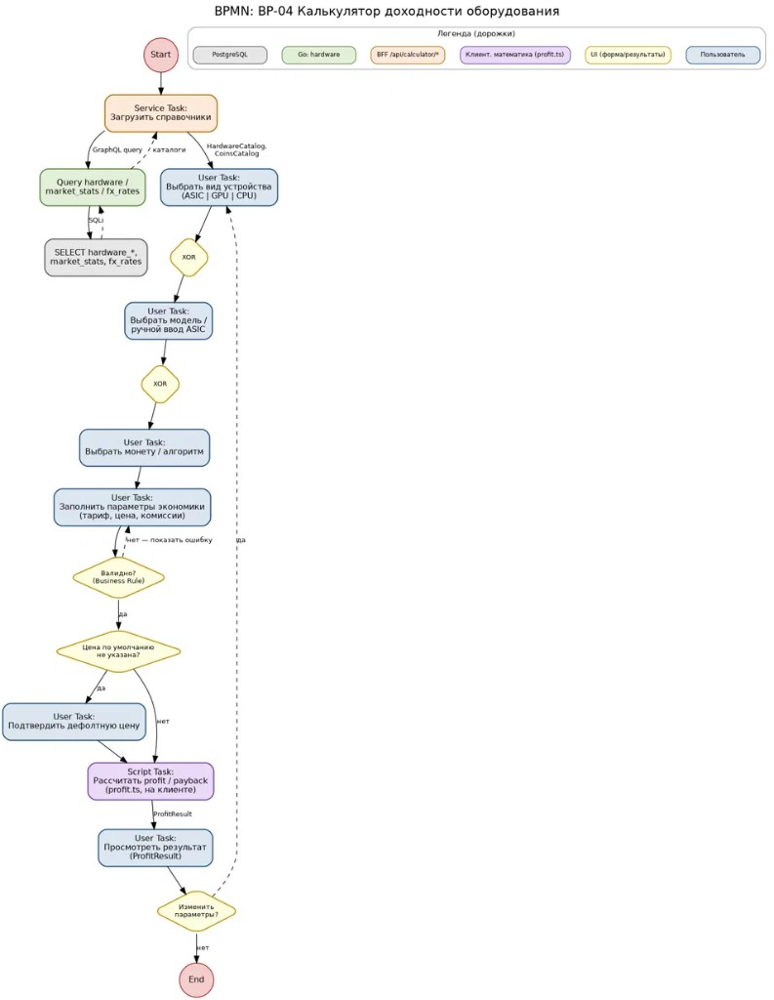
</p>
</details>

<details>
<summary><strong>BPMN — заявка / лид (BP-10)</strong></summary>
<br/>
<p align="center">
  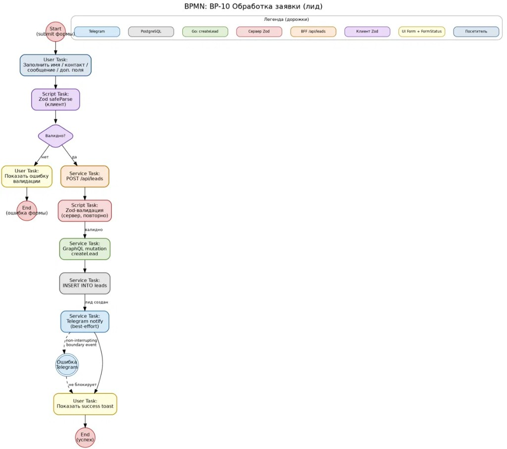
</p>
</details>

<details>
<summary><strong>Sequence — статьи и лиды</strong></summary>
<br/>
<p align="center">
  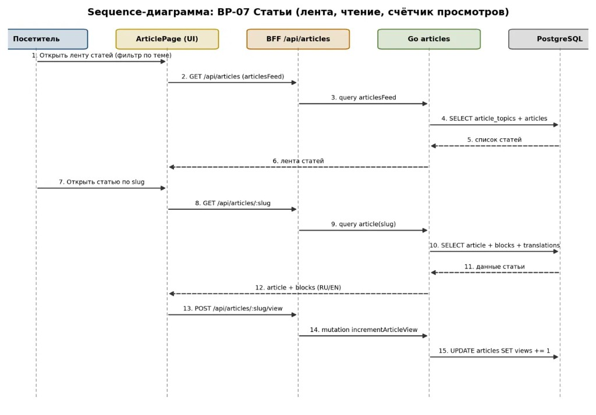
</p>
<p align="center">
  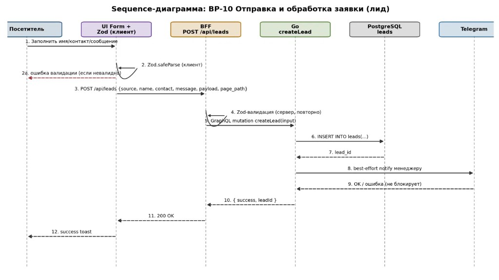
</p>
</details>

<details>
<summary><strong>ER — контент и каталог / hardware</strong></summary>
<br/>
<p align="center">
  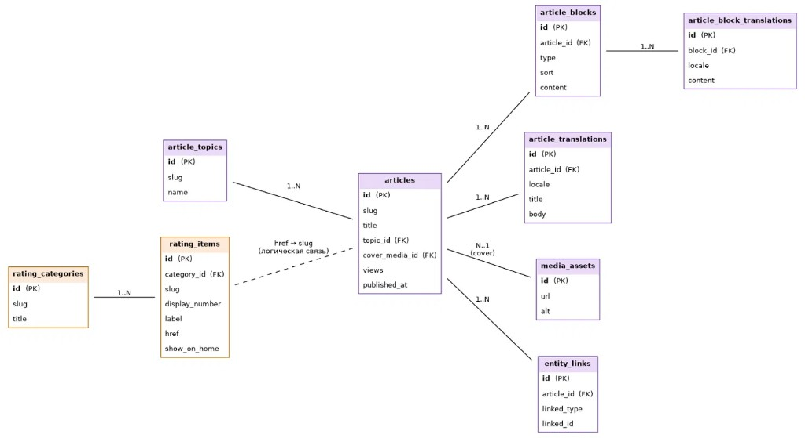
</p>
<p align="center">
  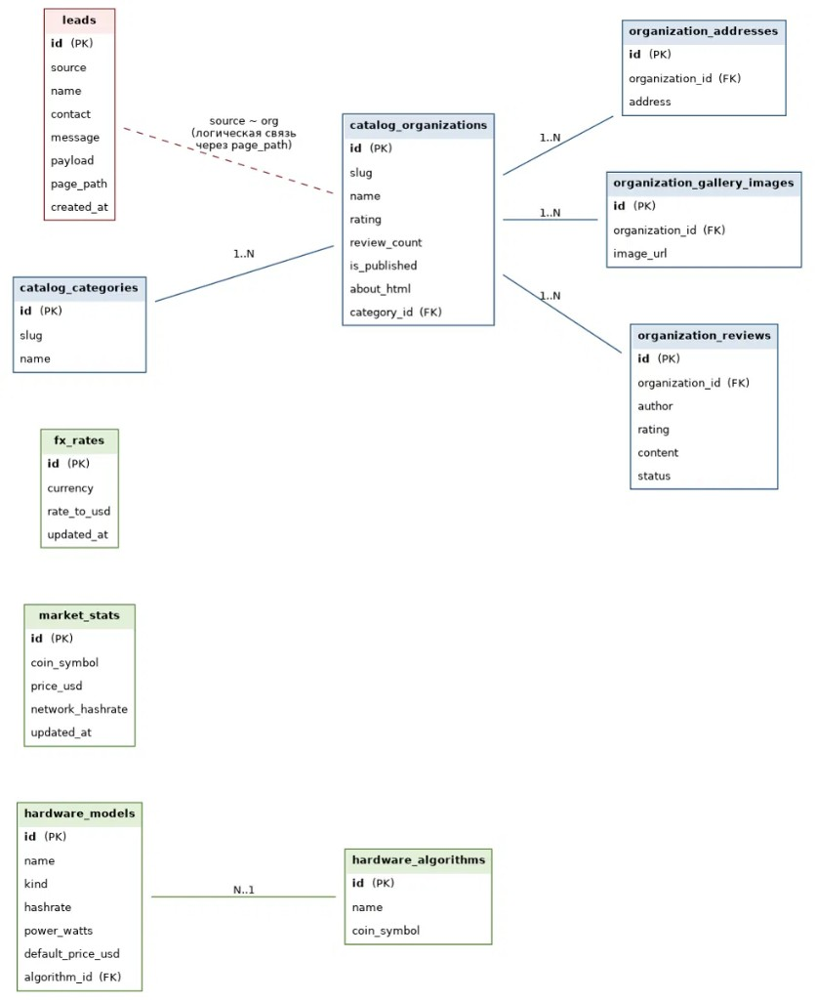
</p>
</details>

---

## Архитектура (кратко)

| Документ | Содержание |
|----------|------------|
| [`docs/architecture.md`](./docs/architecture.md) | Слои, GraphQL, BPMN калькулятора |
| [`docs/frontend.md`](./docs/frontend.md) | Зоны фронтенда |
| [`docs/calculator.md`](./docs/calculator.md) | Формулы и UI калькулятора |
| [`docs/leads.md`](./docs/leads.md) | Заявки и Zod |
| [`docs/testing.md`](./docs/testing.md) | Vitest + Playwright |
| PDF | [Архитектура](./docs/top-mining-architecture.pdf) · [Калькулятор](./docs/mining-calculator-guide.pdf) |

<p align="center">
  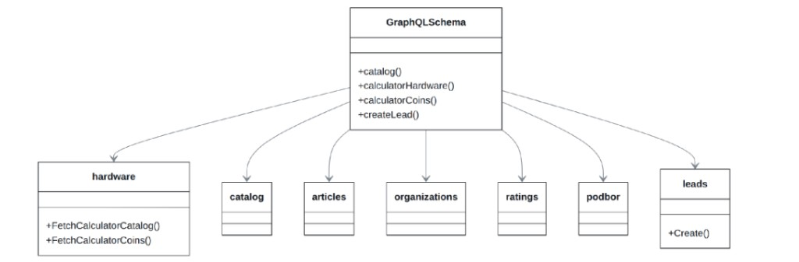
</p>

<details>
<summary>Ещё схемы (sequence / ER / flowchart)</summary>
<br/>
<p align="center">
  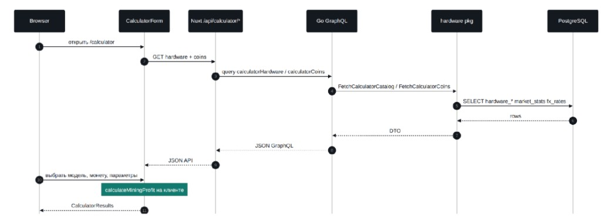
</p>
<p align="center">
  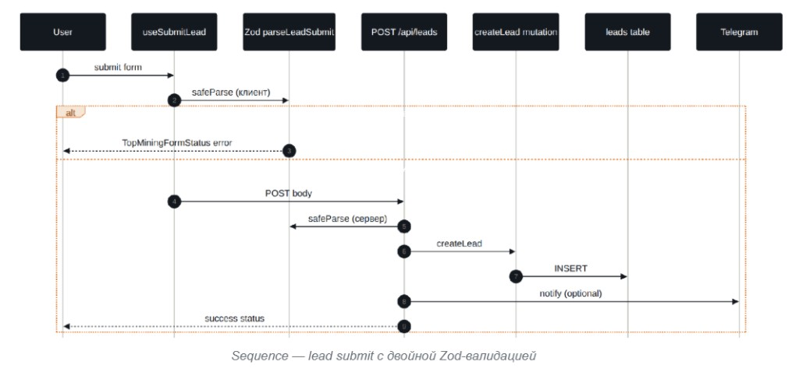
</p>
<p align="center">
  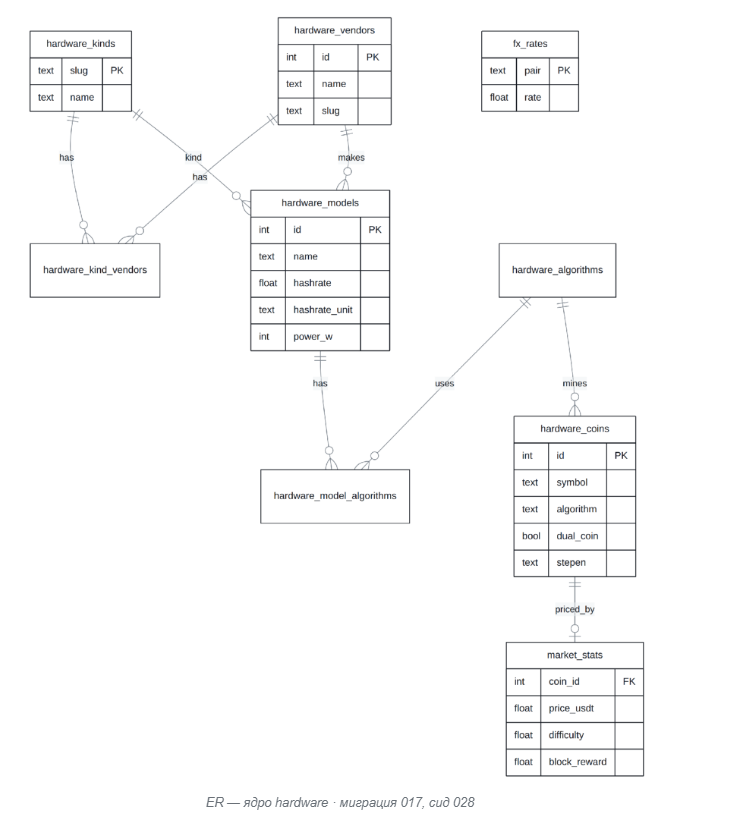
</p>
<p align="center">
  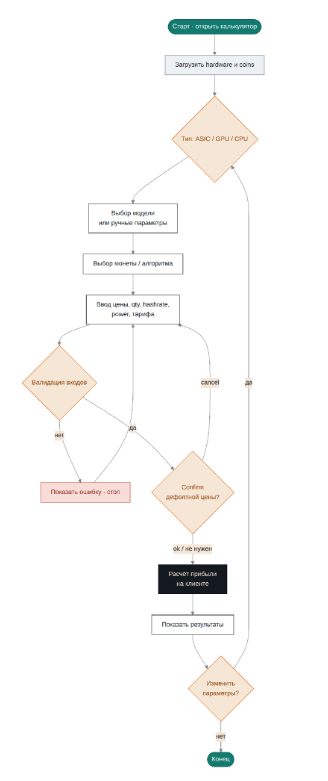
</p>
</details>

---

## Структура

```text
top-mining/
├── pages/              # маршруты
├── components/         # UI по доменам
├── common/modules/     # чистая логика и тексты
├── server/api/         # Nitro → GraphQL
├── stories/ · test/ · tests/   # Storybook · Vitest · Playwright
├── docs/               # бизнес, архитектура, схемы
└── backend/            # Go + Postgres + миграции
```

**Принципы:** страница собирает → компонент рисует → модуль считает → API отдаёт данные.

---

<p align="center">
  
  <br/>
  <sub>© Top Mining</sub>
</p>
