# Полная схема БД Top Mining (niklad)

PostgreSQL 16 · база `niklad` · порт `5433`

---

## Обзор системы (3 домена)

```
┌─────────────────────────────────────────────────────────────────┐
│  ДОМЕН 1: КАТАЛОГ КОМПАНИЙ                                      │
│  Список + фильтры + карточка организации                        │
│  Миграции: 001, 007, 008                                        │
└─────────────────────────────────────────────────────────────────┘

┌─────────────────────────────────────────────────────────────────┐
│  ДОМЕН 2: СТАТЬИ                                                 │
│  Лента, страница статьи, оглавление                             │
│  Миграции: 003, 004, 005, 006, 007                              │
└─────────────────────────────────────────────────────────────────┘

┌─────────────────────────────────────────────────────────────────┐
│  ДОМЕН 3: МАЙНИНГ-КАЛЬКУЛЯТОР                                    │
│  ASIC / GPU / CPU, модели, курсы, сеть                          │
│  Миграция: 008                                                  │
└─────────────────────────────────────────────────────────────────┘
```

Домены **не связаны FK** между собой (кроме `asic_models` ↔ калькулятор как справочник для фильтра каталога).

---

## Хронология миграций

| Файл | Содержание |
|------|------------|
| `001_init.sql` | `catalog_categories`, `catalog_organizations` + seed |
| `003_articles.sql` | `article_topics`, `articles` + seed |
| `004_article_topics.sql` | правки тем и display_type |
| `005_tools_articles.sql` | статьи «Инструменты» |
| `006_investments_articles.sql` | статьи «Инвестиции» |
| `007_organizations_and_article_detail.sql` | профиль org, отзывы, rusprofile, article_sections |
| `008_catalog_filters_and_calculator.sql` | фильтры каталога, калькулятор |

---

## ДОМЕН 1: Каталог

### 1.1 Список и категории

#### `catalog_categories`

| Колонка | Тип | Ограничения |
|---------|-----|-------------|
| id | SERIAL | PK |
| name | TEXT | NOT NULL |
| slug | TEXT | UNIQUE, NOT NULL |
| sort_order | INT | DEFAULT 0 |

**Slugs (008):** `asic-sales`, `mining-hotels`, `equipment-manufacturers`, `mining-pools`, `asic-repair`, `crypto-exchanges`, `crypto-wallets`, `asic-firmware`, `events`

**Связь:** `1 ──< N` → `catalog_organizations.category_id`

---

#### `catalog_organizations` (расширена в 007, 008)

| Колонка | Тип | Миграция | Назначение |
|---------|-----|----------|------------|
| id | SERIAL | 001 | PK |
| category_id | INT FK | 001 | основная вкладка каталога |
| name | TEXT | 001 | |
| slug | TEXT UNIQUE | 007 | URL `/sale_asic/{slug}/` |
| logo_url | TEXT | 001 | |
| description | TEXT | 001 | кратко в списке |
| rating | NUMERIC(2,1) | 001 | |
| review_count | INT | 001 | |
| sort_order | INT | 001 | |
| tagline | TEXT | 007 | подзаголовок на карточке |
| page_title | TEXT | 007 | SEO H1 |
| founded_year | INT | 007 | фильтр «на рынке N лет» |
| website, email, work_hours | TEXT | 007 | |
| domain_registered_at | DATE | 007 | |
| about_html | TEXT | 007 | «О компании» |
| map_lat, map_lng | NUMERIC | 007 | Яндекс.Карта |
| verified_contracts | BOOLEAN | 007 | ТОП МАЙНИНГ |
| verified_legal_entity | BOOLEAN | 007 | |
| has_public_rating | BOOLEAN | 007 | |
| is_published | BOOLEAN | 007 | |
| updated_at | TIMESTAMPTZ | 007 | |
| sells_used_asic | BOOLEAN | 008 | фильтр «Продажа Б/У» |
| office_city | TEXT | 008 | «Офис: Москва» на карточке |

---

### 1.2 Фильтры страницы каталога (008)

#### `catalog_services` — чекбоксы «Услуга»

| Колонка | Тип |
|---------|-----|
| id | SERIAL PK |
| slug | TEXT UNIQUE |
| label | TEXT |
| sort_order | INT |

#### `organization_services` — M:N организация ↔ услуга

| organization_id | INT FK → catalog_organizations |
| service_id | INT FK → catalog_services |
| **PK** | (organization_id, service_id) |

---

#### `catalog_locations` — города/регионы

| Колонка | Тип |
|---------|-----|
| id | SERIAL PK |
| name | TEXT |
| region | TEXT |
| sort_order | INT |
| **UNIQUE** | (name, region) |

#### `organization_delivery_areas` — M:N «Города доставки»

| organization_id | INT FK |
| location_id | INT FK |
| **PK** | (organization_id, location_id) |

> Офисы: таблица `organization_addresses` (007), не дублируется.

---

#### `catalog_tags` — бейджи на карточках

| Колонка | Тип | Пример |
|---------|-----|--------|
| id | SERIAL PK | |
| slug | TEXT UNIQUE | `with-vat` |
| label | TEXT | «С НДС» |
| tag_group | TEXT | `payment`, `condition`, `volume`, `availability`, `highlight` |
| sort_order | INT | |

#### `organization_tags` — M:N

| organization_id | INT FK |
| tag_id | INT FK |
| **PK** | (organization_id, tag_id) |

---

#### `asic_models` — справочник для фильтра «Модель ASIC»

| Колонка | Тип |
|---------|-----|
| id | SERIAL PK |
| manufacturer_slug | TEXT |
| name | TEXT |
| hashrate_th | NUMERIC(10,2) |
| power_watts | INT |
| algorithm_slug | TEXT |
| sort_order | INT |
| **UNIQUE** | (manufacturer_slug, name) |

#### `organization_asic_models` — M:N какие модели продаёт компания

---

### 1.3 Профиль организации (007) — без изменений в 008

| Таблица | Связь | Назначение UI-блока |
|---------|-------|---------------------|
| organization_addresses | 1:N | офисы |
| organization_gallery_images | 1:N | галерея |
| organization_equipment_sales | 1:0..1 | «Продажа оборудования» |
| organization_mining_hotels | 1:0..1 | «Майнинг-отель» |
| organization_payment_terms | 1:0..1 | «Оплата услуг» |
| organization_legal_profiles | 1:0..1 | rusprofile |
| organization_reviews | 1:N | отзывы |
| organization_review_replies | 1:N | ответы |

---

## ДОМЕН 2: Статьи

#### `article_topics`

| id TEXT PK | mining, tools, investments, beginners |
| label | TEXT |
| sort_order | INT |

#### `articles`

| Колонка | Тип | Примечание |
|---------|-----|------------|
| id | SERIAL PK | |
| slug | TEXT UNIQUE | |
| title | TEXT | строка 1 заголовка |
| title_subtitle | TEXT | строка 2 (007) |
| excerpt, content, content_html | TEXT | |
| image_url, image_alt | TEXT | |
| topic_id | TEXT FK | |
| reading_time_min | INT | |
| view_count | INT | (007) |
| published_at | DATE | |
| display_type | TEXT | hero \| featured \| list |
| sort_order | INT | |
| is_published | BOOLEAN | |

#### `article_sections` — оглавление (007)

| article_id | INT FK |
| anchor | TEXT |
| title | TEXT |
| level | SMALLINT 2..4 |
| sort_order | INT |

#### `article_related` — «Читайте также» (007)

| article_id | INT FK PK |
| related_article_id | INT FK PK |
| sort_order | INT |

---

## ДОМЕН 3: Калькулятор (008)

### 3.1 Иерархия железа

```
calculator_hardware_types (asic, gpu, cpu)
        │
        ├── calculator_manufacturers
        │         └── calculator_manufacturer_types (M:N тип↔производитель)
        │
        └── calculator_hardware_models
                  ├── calculator_model_specs (EAV характеристики CPU/GPU)
                  └── calculator_model_algorithms (M:N модель↔алгоритм↔монета)
```

#### `calculator_hardware_types`

| id TEXT PK | asic, gpu, cpu |
| label | TEXT |
| sort_order | INT |

#### `calculator_manufacturers`

| id | SERIAL PK |
| slug | TEXT UNIQUE |
| name | TEXT |
| logo_url | TEXT |
| description_html | TEXT |
| sort_order | INT |

#### `calculator_manufacturer_types` — M:N

| manufacturer_id | INT FK |
| hardware_type_id | TEXT FK |
| **PK** | (manufacturer_id, hardware_type_id) |

#### `mining_algorithms`

| id TEXT PK | sha-256, scrypt, ethash, kawpow, randomx |
| name | TEXT |
| sort_order | INT |

#### `mining_coins`

| id TEXT PK | bitcoin, monero… |
| name, symbol | TEXT |
| icon_url | TEXT |
| algorithm_id | TEXT FK → mining_algorithms |
| sort_order | INT |

#### `calculator_hardware_models`

| Колонка | Тип | UI-поле калькулятора |
|---------|-----|----------------------|
| id | SERIAL PK | |
| hardware_type_id | TEXT FK | вкладка ASIC/GPU/CPU |
| manufacturer_id | INT FK | бренд в dropdown |
| slug | TEXT UNIQUE | URL `/cpu/amd/ryzen-9-7950x3d/` |
| name | TEXT | «Модель ASIC-майнера» |
| release_year | INT | |
| description_html | TEXT | «Описание производителя» |
| default_price_rub | NUMERIC(14,2) | «Цена ASIC-майнера» |
| default_hashrate | NUMERIC(16,4) | «Хешрейт» |
| hashrate_unit | TEXT | TH/s, MH/s, KH/s |
| default_power_watts | INT | «Потребление» |
| sort_order | INT | |

#### `calculator_model_algorithms` — модель на разных алгоритмах

| model_id | INT FK PK |
| algorithm_id | TEXT FK PK |
| coin_id | TEXT FK nullable |
| hashrate | NUMERIC |
| hashrate_unit | TEXT |
| is_default | BOOLEAN |

#### `calculator_model_specs` — таблица характеристик (CPU)

| model_id | INT FK |
| spec_key | TEXT | «Сокет», «TDP»… |
| spec_value | TEXT |
| sort_order | INT |
| **UNIQUE** | (model_id, spec_key) |

---

### 3.2 Рыночные данные

#### `exchange_rates`

| pair | TEXT UNIQUE | BTC-USDT, USDT-RUB |
| base_currency, quote_currency | TEXT |
| rate | NUMERIC(20,8) |
| updated_at | TIMESTAMPTZ |

#### `network_coin_stats`

| coin_id | TEXT PK FK |
| block_reward_btc | NUMERIC | «Награда за блок» |
| network_difficulty | NUMERIC | «Сложность сети» |
| updated_at | TIMESTAMPTZ |

#### `calculator_defaults` — дефолты формы

| id TEXT PK | uptime_pct, pool_fee_pct, electricity_rub_per_kwh… |
| value | NUMERIC |
| unit | TEXT |
| label | TEXT |

---

## Полная ER-диаграмма (Mermaid)

```mermaid
erDiagram
    %% === КАТАЛОГ ===
    catalog_categories ||--o{ catalog_organizations : category_id
    catalog_organizations ||--o{ organization_addresses : organization_id
    catalog_organizations ||--o{ organization_gallery_images : organization_id
    catalog_organizations ||--o| organization_equipment_sales : organization_id
    catalog_organizations ||--o| organization_mining_hotels : organization_id
    catalog_organizations ||--o| organization_payment_terms : organization_id
    catalog_organizations ||--o| organization_legal_profiles : organization_id
    catalog_organizations ||--o{ organization_reviews : organization_id
    organization_reviews ||--o{ organization_review_replies : review_id
    catalog_services ||--o{ organization_services : service_id
    catalog_organizations ||--o{ organization_services : organization_id
    catalog_tags ||--o{ organization_tags : tag_id
    catalog_organizations ||--o{ organization_tags : organization_id
    catalog_locations ||--o{ organization_delivery_areas : location_id
    catalog_organizations ||--o{ organization_delivery_areas : organization_id
    asic_models ||--o{ organization_asic_models : asic_model_id
    catalog_organizations ||--o{ organization_asic_models : organization_id

    %% === СТАТЬИ ===
    article_topics ||--o{ articles : topic_id
    articles ||--o{ article_sections : article_id
    articles ||--o{ article_related : article_id
    articles ||--o{ article_related : related_article_id

    %% === КАЛЬКУЛЯТОР ===
    calculator_hardware_types ||--o{ calculator_hardware_models : hardware_type_id
    calculator_manufacturers ||--o{ calculator_hardware_models : manufacturer_id
    calculator_manufacturers ||--o{ calculator_manufacturer_types : manufacturer_id
    calculator_hardware_types ||--o{ calculator_manufacturer_types : hardware_type_id
    mining_algorithms ||--o{ mining_coins : algorithm_id
    calculator_hardware_models ||--o{ calculator_model_algorithms : model_id
    mining_algorithms ||--o{ calculator_model_algorithms : algorithm_id
    mining_coins ||--o{ calculator_model_algorithms : coin_id
    calculator_hardware_models ||--o{ calculator_model_specs : model_id
    mining_coins ||--o| network_coin_stats : coin_id
```



---

## Итого: 32 таблицы

| # | Таблица | Домен |
|---|---------|-------|
| 1–2 | catalog_categories, catalog_organizations | Каталог |
| 3–10 | organization_* (8 таблиц профиля) | Каталог |
| 11–16 | catalog_services, organization_services, catalog_locations, organization_delivery_areas, catalog_tags, organization_tags | Каталог фильтры |
| 17–18 | asic_models, organization_asic_models | Каталог фильтры |
| 19–22 | article_topics, articles, article_sections, article_related | Статьи |
| 23–32 | calculator_* (10 таблиц) | Калькулятор |

---

## Seed-данные в 008

**Калькулятор:**
- 3 типа железа, 10 производителей
- 5 алгоритмов, 5 монет
- 5 ASIC-моделей, 4 CPU (Ryzen), 3 GPU
- Характеристики Ryzen 9 7950X3D (11 полей)
- Курсы BTC-USDT 60366, USDT-RUB 76.89
- Дефолты: uptime 99%, pool 4%, электричество 5.5 ₽/кВт·ч

**Каталог:**
- 5 новых категорий
- 11 тегов, 4 услуги, 7 городов
- Привязки r7miner, ttm-mining, dc-mining

---

## Применение

```powershell
Get-Content backend\migrations\008_catalog_filters_and_calculator.sql |
  docker exec -i niklad-postgres psql -U niklad -d niklad
```

Или `docker compose down -v && docker compose up -d` для чистой БД (001–008).

---

## Инструкция для ИИ (рисование UML)

> PostgreSQL база **niklad**, 32 таблицы, 3 изолированных домена. Каталог: центральная `catalog_organizations` с 12 дочерними/M:N таблицами для списка, фильтров и профиля. Статьи: `articles` + sections + related. Калькулятор: иерархия hardware_types → manufacturers → models → specs/algorithms; отдельно exchange_rates, network_coin_stats, calculator_defaults. Все FK ON DELETE CASCADE кроме coin_id SET NULL в model_algorithms.
