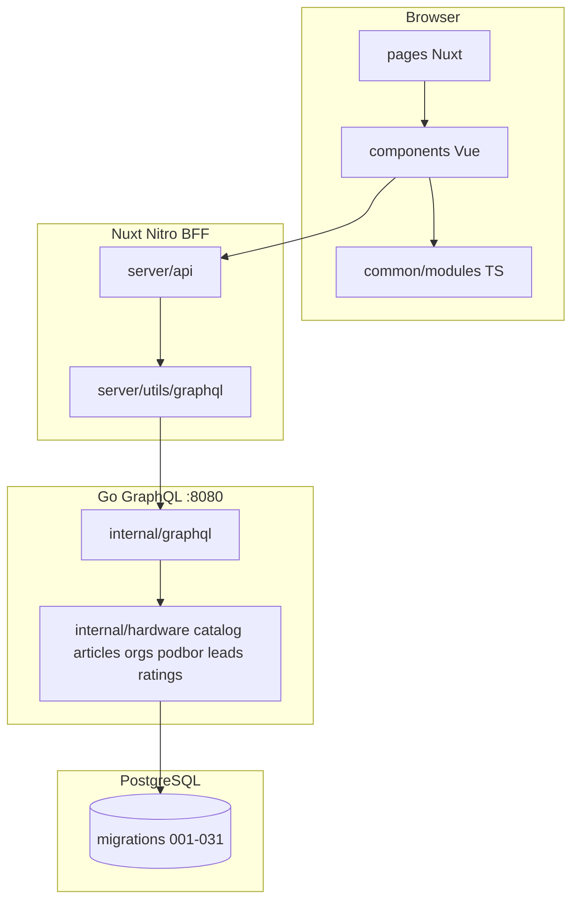
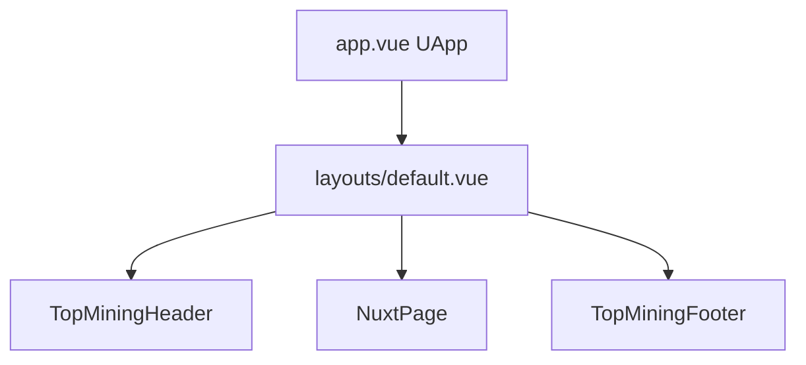
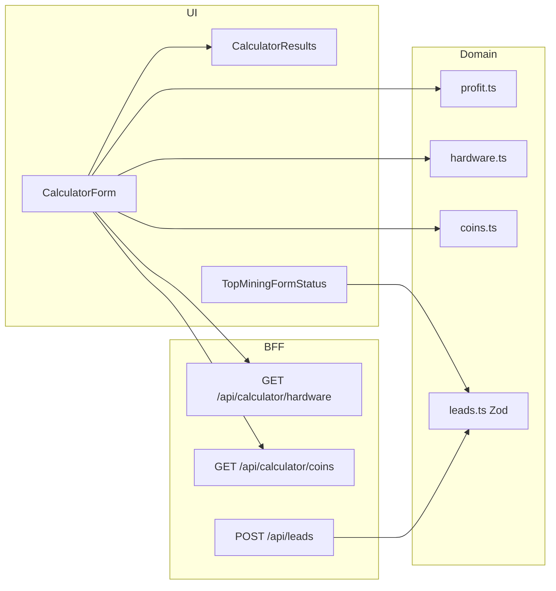
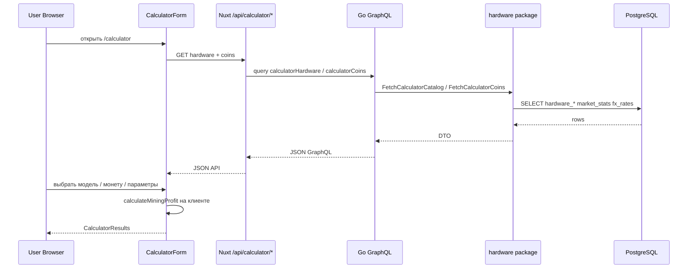
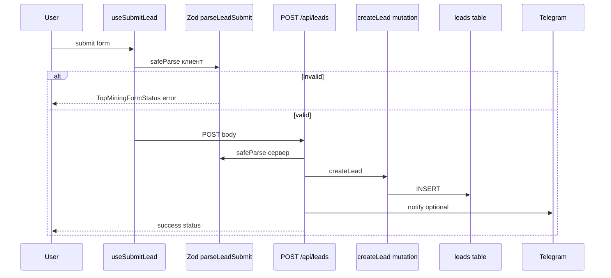
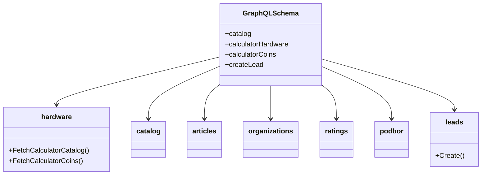
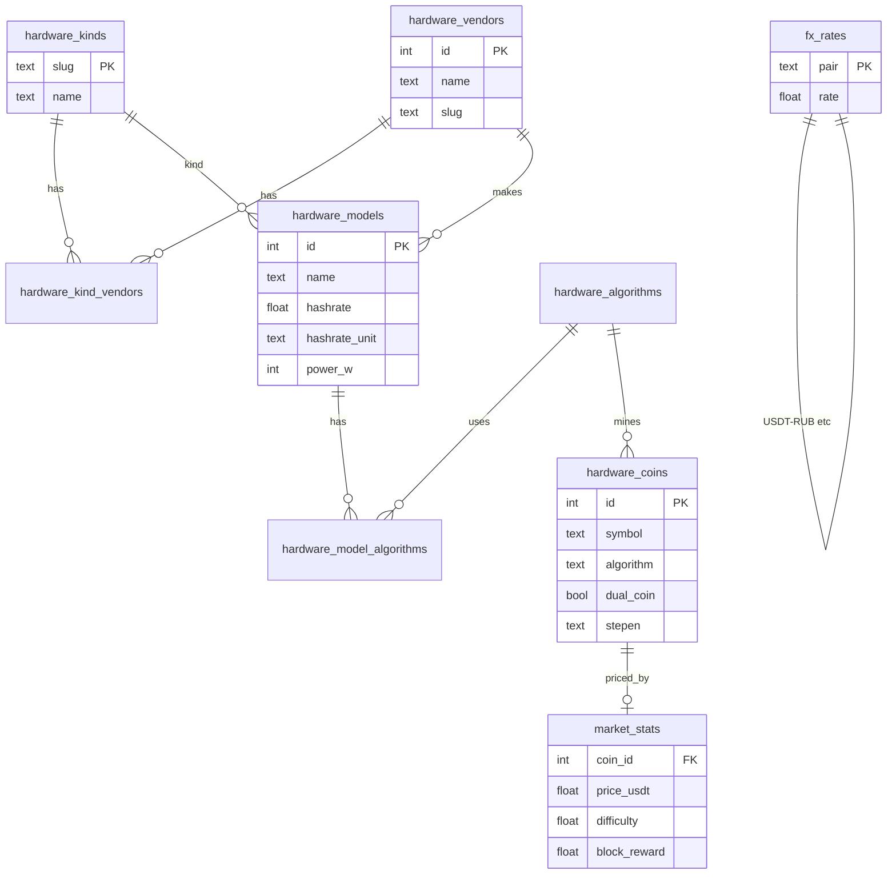
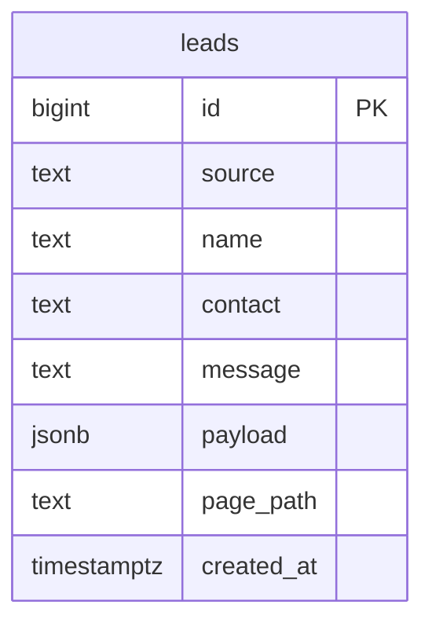
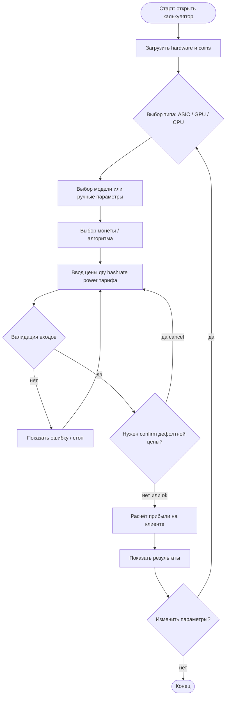

# Архитектура Top Mining: фронтенд, бэкенд, схемы, калькулятор (BPMN)

Документ для онбординга и моделирования процессов (BPMN / UML).  
Бизнес-процессы и задачи ИС: [`top-mining-business-processes.docx`](./top-mining-business-processes.docx) · схемы PNG: [`diagrams/business/`](./diagrams/business/).  
Детали калькулятора: [`calculator.md`](./calculator.md).  
Заявки и Zod: [`leads.md`](./leads.md).  
Слои клиента: [`frontend.md`](./frontend.md).  
Backend ops: [`../backend/README.md`](../backend/README.md).

---

## 1. Общая картина системы



| Слой | Стек | Ответственность |
|------|------|-----------------|
| **Frontend** | Nuxt 3, Vue 3, TS, Quasar, Tailwind, SCSS | UI, локальный стейт форм, клиентский расчёт прибыли |
| **BFF** | Nitro `server/api/*` | HTTP для браузера, Zod-валидация заявок/подписки, прокси GraphQL, SMTP/Telegram |
| **Backend** | Go + `graphql-go` | Каталоги, статьи, рейтинги, org detail, leads mutation |
| **DB** | PostgreSQL 16 (Docker) | Источник правды для каталога и seed калькулятора |

**Важно:** математика калькулятора выполняется **только на клиенте** (`common/modules/top-mining/calculator/profit.ts`). API отдаёт каталог железа/монет и рыночные дефолты.

---

## 2. Как устроен фронтенд

### 2.1. Слои (правила)

1. **`pages/`** — маршрут, SEO, `useFetch`, композиция секций (тонкие).
2. **`components/`** — UI и локальный стейт (открыт дропдаун, вкладка).
3. **`common/modules/`** — доменная логика без Vue: типы, формулы, тексты, Zod-схемы.
4. **`composables/`** — auto-import хуки (`useSubmitLead`, `useTopMiningLocale`, …).
5. **`server/api/`** — BFF к Go / внешним сервисам.

Не класть бизнес-формулы в `.vue` и разметку в `common/modules/`.

### 2.2. Оболочка страницы



### 2.3. Основные домены UI

| Домен | Папка компонентов | Модуль |
|-------|-------------------|--------|
| Калькулятор | `components/calculator/` | `common/modules/top-mining/calculator/` |
| Каталог | `components/catalog/` | `common/modules/catalog/` |
| Статьи | `components/articles/` | `common/modules/articles/` |
| Рейтинги | `components/rating/` | `common/modules/ratings/` |
| Подбор / майнинг-отель | `components/podbor/` | `common/modules/top-mining/podbor/` |
| Заявки / статус | формы + `TopMiningFormStatus` | `layout/leads.ts`, `layout/subscribe.ts` |
| Хедер / локаль | `components/top-mining/header/` | `layout/locale.ts` |

### 2.4. Component diagram (фронт)



---

## 3. Как устроен бэкенд

### 3.1. Структура

```text
backend/
  cmd/server/          # HTTP GraphQL :8080
  cmd/migrate/         # применение SQL
  internal/
    graphql/schema.go  # Query + Mutation
    hardware/          # каталог калькулятора
    catalog/           # категории организаций
    articles/
    organizations/
    ratings/
    podbor/            # placement / sale offers
    leads/             # INSERT заявок
  migrations/          # 001 … 031
```

### 3.2. Sequence: каталог калькулятора



### 3.3. Sequence: заявка



---

## 4. GraphQL API (схема операций)

Источник: `backend/internal/graphql/schema.go`, документы: `server/graphql/queries.ts`.

### Queries

| Домен | Операция | Назначение |
|-------|----------|------------|
| Catalog | `catalog` | Категории / организации каталога |
| Calculator | `calculatorHardware` | Бренды/модели ASIC/GPU/CPU |
| Calculator | `calculatorCoins` | Монеты, алгоритмы GPU, defaultUsdtRub |
| Podbor | `podborPlacementOffers` | Карточки размещения |
| Podbor | `podborSaleOffers` | Карточки продажи |
| Articles | `articlesFeed(topic)` | Лента |
| Articles | `article(slug)` | Статья |
| Orgs | `organization(slug)` | Карточка организации |
| Orgs | `organizationReviews(slug, sort)` | Отзывы |
| Ratings | `ratings`, `ratingsHome` | Рейтинги |

### Mutations

| Домен | Операция |
|-------|----------|
| Articles | `incrementArticleView(slug)` |
| Orgs | `createOrganizationReview(...)` |
| Leads | `createLead(source, name, contact, message, payload, pagePath)` |

### UML: GraphQL ↔ пакеты Go



---

## 5. Nuxt BFF routes (`server/api`)

| Группа | Метод | Путь |
|--------|-------|------|
| Calculator | GET | `/api/calculator/hardware` |
| Calculator | GET | `/api/calculator/coins` |
| Catalog | GET | `/api/catalog`, `/api/catalog/manufacturers`, `/api/catalog/organizations/[slug]` |
| Catalog | GET/POST | `/api/catalog/organizations/[slug]/reviews` |
| Articles | GET | `/api/articles`, `/api/articles/[slug]` |
| Articles | POST | `/api/articles/[slug]/view` |
| Ratings | GET | `/api/ratings`, `/api/ratings/home` |
| Podbor | GET | `/api/podbor/placement`, `/api/podbor/sale` |
| Crypto | GET | `/api/crypto` |
| Leads | POST | `/api/leads` |
| Subscribe | POST | `/api/subscribe` |

---

## 6. Схемы данных (БД) — ER (логическая)

Источник правды: SQL в `backend/migrations/`. PlantUML-файл в README упоминается, но актуальная схема — миграции.

### 6.1. Калькулятор / hardware (ядро)



Миграции: `017_hardware_domain.sql`, сид `028_calculator_catalog_seed.sql` (+ `calculator_settings`).

### 6.2. Заявки



Миграция: `031_leads.sql`.

### 6.3. Прочие домены (кратко)

| Домен | Миграции (ориентиры) | Сущности |
|-------|----------------------|----------|
| Организации / каталог | `003`, `010`, `025`… | org, категории, профили |
| Статьи | `002`, `018`, `027` | articles, blocks, views |
| Рейтинги / отзывы | `005`, `006`, `019` | ratings, reviews |
| Podbor offers | `029`, `030` | placement / sale cards |

---

## 7. Zod-схемы (контракты API)

| Схема | Файл | Поля |
|-------|------|------|
| `leadSubmitSchema` | `common/.../layout/leads.ts` | source*, contact*, name, message, fields, website, pagePath |
| `subscribeSubmitSchema` | `common/.../layout/subscribe.ts` | email*, source?, website |

Проверка на клиенте и в BFF (`safeParse`).

---

## 8. Бизнес-процесс калькулятора (для BPMN)

Ниже — текстовая модель, удобная для переноса в BPMN 2.0 (Camunda / Bizagi / draw.io BPMN).

### 8.1. Участники (lanes)

| Lane | Кто |
|------|-----|
| **Пользователь** | Майнер / посетитель сайта |
| **UI Калькулятор** | `CalculatorForm` / `CalculatorResults` |
| **Клиентская математика** | `profit.ts` |
| **BFF Nuxt** | `/api/calculator/*` |
| **Backend Go** | GraphQL + `hardware` |
| **PostgreSQL** | Каталог и market data |

### 8.2. Старт / триггер

- **Start Event:** пользователь открывает `/calculator/` (или блок калькулятора на главной).

### 8.3. Основной процесс (happy path)

1. **Load catalogs** (Service Task, UI → BFF → Go → DB)  
   - Загрузить hardware (ASIC/GPU/CPU brands→models).  
   - Загрузить coins + gpuAlgorithms + defaultUsdtRub.  
   - Пока loading — скелетоны дропдаунов.

2. **Select device kind** (User Task)  
   - Gateway: `asic` | `gpu` | `cpu`.  
   - Side effect: сброс модели/хешрейта/мощности; для ASIC дефолт монета BTC.

3. **Select or unlock equipment** (User Task + Exclusive Gateway)  
   - **ASIC:** выбрать модель **или** «Ввести параметры» вручную.  
   - **GPU/CPU:** модель обязательна (иначе поля locked).  
   - При выборе модели: подставить hashrate, unit, powerW (+ algorithm для GPU/CPU).

4. **Select coin / algorithm** (User Task)  
   - ASIC: монета из списка.  
   - GPU/CPU: сначала алгоритм, затем монеты, отфильтрованные по алгоритму.  
   - Dual-coin (LTC+DOG): два курса USDT.

5. **Fill economics** (User Task)  
   - Цена устройства + валюта, количество.  
   - Хешрейт + единица, мощность Вт.  
   - Тариф электроэнергии + валюта.  
   - Опционально advanced: uptime, pool fee, курсы, block reward, difficulty.

6. **Validate inputs** (Business Rule / Gateway)  
   - Есть ли ноги расчёта (coin legs)?  
   - hashrate > 0? power > 0? price > 0?  
   - **No** → End (показать ошибку / не считать).  
   - **Yes** → дальше.

7. **Optional: default price modal** (User Task / Gateway)  
   - Если цена «дефолтная» — спросить подтверждение.  
   - Cancel → вернуться к форме.  
   - Confirm → расчёт.

8. **Calculate profit** (Script Task на клиенте)  
   Подпроцесс:
   1. Нормализовать hashrate → TH/s.  
   2. Разобрать `stepen` (`2v32` / `2v13` / 1).  
   3. Посчитать монеты за день/месяц/год (доля сети × block reward × uptime × qty × (1−poolFee)).  
   4. Dual: сумма двух legs.  
   5. Доход USDT / RUB (× курсы).  
   6. Стоимость размещения (эл-во) за месяц.  
   7. Чистая прибыль / месяц.  
   8. Окупаемость (месяцы) или null.

9. **Show results** (User Task)  
   - Вкладки: монета / USDT / ₽.  
   - Доход (час/день/месяц/год), размещение/мес, чистая прибыль/мес, окупаемость.

10. **End Event:** пользователь изучает результат / меняет параметры → цикл с шага 2–5.

### 8.4. BPMN-диаграмма (Mermaid ≈ процесс)



### 8.5. Данные процесса (Data Objects для BPMN)

| Data Object | Содержимое |
|-------------|------------|
| `HardwareCatalog` | brands → models (hashrate, power, unit, algorithm) |
| `CoinsCatalog` | coins, algorithms, defaultUsdtRub, dual flags |
| `CalculatorFormState` | все поля формы |
| `ProfitLegs` | 1–2 ноги: reward, difficulty, rate, stepen |
| `ProfitResult` | coins*, income*, placingMonth, cleanProfit, paybackMonths |

### 8.6. Формулы (для documentation / script task)

```text
HR_ths = hashrate × unitFactor
poolFactor = (100 - poolFee%) / 100
uptime = uptimePercent / 100

coins_period = (blockReward × HR_ths × 1e12 × 86400 × poolFactor × days × uptime × qty)
               / (difficulty × stepen)

income_usdt = Σ (coins_leg × coinUsdtRate_leg)
placing_month_rub = (powerW/1000) × 732 × uptime × electricityRub × qty
clean_month = income_month - placing_month
payback_months = deviceCost / clean_month   (если clean_month > 0)
```

Полная спецификация: [`docs/calculator.md`](./calculator.md).

### 8.7. Исключения / альтернативные потоки

| Событие | Поведение |
|---------|-----------|
| API hardware/coins недоступен | UI скелетоны / пустые списки; расчёт без модели ограничен |
| Dual-coin без курсов | Валидация не пускает в расчёт |
| Чистая прибыль ≤ 0 | `paybackMonths = null` («Не окупается») |
| Смена вкладки ASIC↔GPU | Сброс зависимого стейта (прерывание текущего сценария) |

---

## 9. Связанные процессы (кратко)

| Процесс | Триггер | Результат |
|---------|---------|-----------|
| Заявка с формы | Submit + Zod | row в `leads` + Telegram |
| Подписка | email + Zod | SMTP welcome ± Telegram |
| Просмотр статьи | открытие slug | `incrementArticleView` |
| Отзыв об организации | форма отзыва | `createOrganizationReview` |

---

## 10. Как собрать BPMN в инструменте

Рекомендуемый mapping:

1. **Pool** «Top Mining Calculator».  
2. **Lanes:** Пользователь | UI | Клиентская математика | BFF | Go | PostgreSQL.  
3. **Tasks** из §8.3 (имена 1:1).  
4. **Gateways** из §8.3 п.2, 3, 6, 7, 10.  
5. **Data Objects** из §8.5 привязать к стрелкам Load / Calculate / Show.  
6. **Message flows:** UI↔BFF (`GET hardware/coins`), BFF↔Go (GraphQL), Go↔DB (SQL).

Можно импортировать Mermaid из §8.4 как черновик процесса, затем уточнить lanes.
